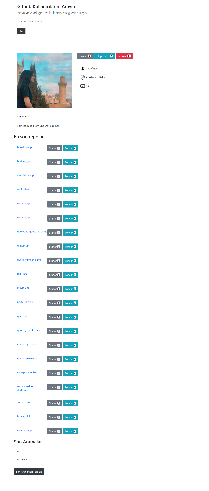

# Github Api

## Welcome! 👋

Thanks for checking out this project.

**To do this project, you need to know HTML,Bootstrap and Javascript**

## The project

[baseURL](https://api.github.com/users/)

### You can see any user's github profile, you can also notice their repos.
